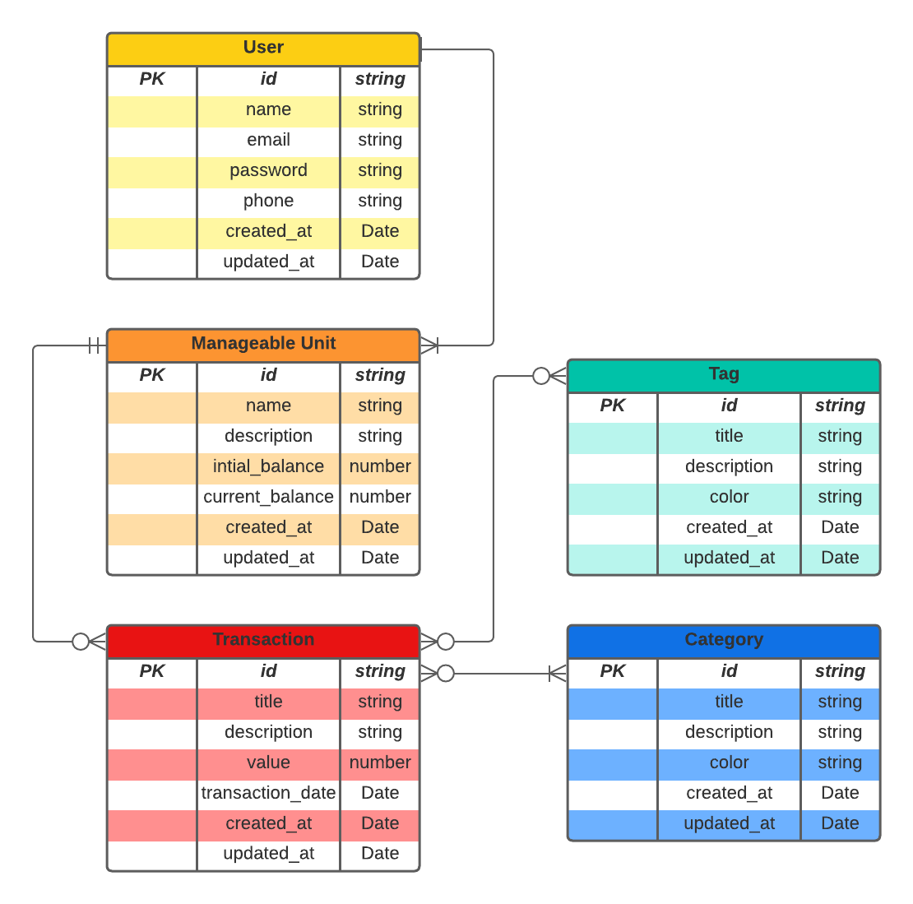

# Finances Manager

## Purpose

This project purpose is to develop an API that allows users to register their monthly financial transactions and then genrate reports based on avaiable data.

 

## Features

Every user will be able to create "entities" to manage its financial transactions. It will be possible to register your personal acount finances apart of your business account.

An user will also be able to register a transactions according to several categories (fixed expenses, occasional expenses, profits and so on...).

Each transaction can also be marked using tags to identify its purpose (supermarket, health, emergency and so on...).

 

## ERD

